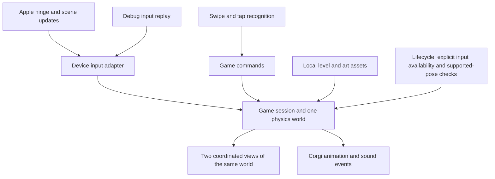

# Fold & Fetch — product requirements and demo design

> **Asset update, September 25, 2026:** The locked style is a cozy cyberpunk rooftop 3D diorama with smooth rounded shapes, restrained warm lighting, and Kaprao wearing removable RGB sunglasses and a teal scarf. The selected character is [fluffy Kaprao v3](../../DesignAssets/Revisions/Kaprao-v3/README.md); root-level Kaprao assets and the old full ZIP contain rejected v1. Read [the remaining-assets status](../../DesignAssets/DEMO-ASSET-CHECKLIST.md) and [the current asset pack](../../DesignAssets/README.md) and [art direction](../../DesignAssets/ART-DIRECTION.md) before older asset guidance below. The pack supplies editable models, native SceneKit assets, animations, UI, and measured validation; this does not certify the future game physics or connected Duo projection.

Version 0.3 · September 25, 2026 · Red-team revision

**Master-Prompt.md is the only execution prompt.** It contains the authoritative time gates, agent contracts, and acceptance evidence. This PRD describes the same single-level product; older prompt files are superseded pointers.

This version supersedes the earlier automatic-walking design. The user explicitly requested swipe left/right to move, swipe up to jump, and swipe down to dash downward. The precise gesture tuning below is a proposed starting point for playtesting, not a previously approved preference.

## 1. Product and purpose

Fold & Fetch is a small, tactile 3D puzzle-platforming demo starring a corgi in a miniature mechanical workshop. The player controls the corgi with simple swipes and changes the machinery by folding the simulated iPhone Duo. The memorable moment is a bridge piece visibly falling from the upper workshop, landing across a lower gap, and becoming a real surface the corgi can cross.

The hackathon deliverable is one complete, enjoyable, replayable demonstration. It is not a full commercial game. The audience is judges and first-time players interested in spatial games; demand from children or any other market remains untested.

Success means a spectator understands that the fold changes the physical world, a player can intentionally improve after a miss, and the demo starts, plays, resets, and finishes reliably. Winning the competition is not an acceptance criterion we can guarantee.

## 2. Event constraints and actual target

The official event page says participants will build with the iPhone Duo simulator in Xcode 27.1 beta because the device ships October 23. A polished demo is sufficient; a complete end-to-end application is not required. Bitrig is optional. The coding window is September 26, 11:30 a.m.–3:30 p.m. San Francisco time. All app code must be created at the hackathon; advance design assets are allowed.

Target: a native iOS 27.1 app running in the Duo simulator on the demo Mac, previewed through Bitrig and verified through Xcode. No physical device is assumed available. Hardware optical quality, motion-sensor characteristics, haptics, thermal behavior, and exact system-transition fidelity remain unverified.

Source: https://events.ycombinator.com/bitrig-hacks-september2026

The organizer email separately specifies one submission per team, a maximum of five people, and use of the RevenueCat SDK for eligibility for its prize. RevenueCat integration is an optional prize branch of scope, not a dependency of the core game.

## 3. Scope and level count

**One required demo level with one bridge puzzle.** Target a 60–90-second presentation including a miss, recovery, and success, with immediate Retry and Replay. This is a design target, not an organizer time limit; do not add filler walking.

A tiny prototype room comes first. It is a technical test of movement, hinge input, one falling object, and reset; it is not a second content level.

The finished level has three short beats:

1. **Meet the corgi:** move across a safe platform. Jump and airborne downward dash are available on an optional safe practice pad, without a mandatory timing obstacle. Brief gesture hints disappear after use.
2. **Repair the route:** reach a gap too wide for the measured maximum jump. Park the corgi, fold to aim the upper chute in depth, let the mechanism settle, tap Release, and watch the beam land or miss. Broad visible supports form a depth channel; a miss enters a recovery tray. This sequence uses one Mac mouse without simultaneous folding and swiping.
3. **Cross and finish:** after genuine seating, visible clamps may hold the same beam in the same pose. Manually guide the corgi across to a clearly visible toy. Celebrate and offer Replay. The beam touching the goal cannot win.

No second puzzle or level in the default four-hour build. Also exclude tilt, head tracking, backend, accounts, and monetization. Future variation can use different mechanical consequences of folding after this demo proves its core loop.

## 4. Controls

The lower gameplay region accepts character gestures. The upper machinery accepts a deliberate tap on a marked release point. Retry, Replay, and contextual Resume are small conventional controls.

| Input | Proposed starting behavior | Constraints |
| --- | --- | --- |
| Swipe right | Move right for a short burst, initially about one body length over 0.35 seconds | Collision-constrained; does not start indefinite running |
| Swipe left | Same movement to the left | May reverse the current horizontal burst |
| Swipe up | Jump | Grounded only; no repeated midair jumps |
| Swipe down | Downward dash with a clear whoosh and landing response | Airborne only, once per airtime; no action when grounded |
| Tap highlighted release | Release the held bridge piece | Only while loaded, active, supported and settled within finite tolerance/time; never require exact angle equality or a new callback |
| Tap Retry / Replay | Retry restores the pre-gap checkpoint; Replay returns to the start | Preserve current live hinge pose; no stale velocities, contacts, timers, or duplicated objects |
| Fold the simulated device | Rotate the upper mechanism continuously relative to the lower world | Actual Apple hinge input must be exercised in the normal demo |

Start gesture recognition at roughly 28 points of movement within 0.08–0.6 seconds. Accept a direction when its axis is at least 1.35 times the other axis; ambiguous diagonals do nothing. These constants are tunable through playtesting. Each touch produces at most one command. Movement remains relative to the lower view: screen-left means left along the route.

Touches starting on a button or upper release target do not also trigger movement. Clear pending gestures on scene changes, interruptions, or canceled touches. Support mouse-drag swipes inside the simulated screen so the demo can be played with the Mac. Dragging the simulator's outer device controls must not be mistaken for an in-app gesture.

Swiping horizontally in the air may provide bounded horizontal adjustment. Test repeated swipes to ensure they cannot extend a jump across the bridge-required gap. Use a visible recovery/checkpoint response after falling; no health system or punishment loop is needed. A missed beam ends via tray/bounds or a short timeout, with Retry always accessible.

## 5. Level geometry and physical rules

Use one unscaled world in meters: X along the lower route, Y upward, and Z for depth. In the chosen pose the hinge axis is X. Rotation about X changes Y/Z, not X: the long beam spans the X gap while folding aims its release depth Z into the supports’ visible catch channel. Document origin, pivot, scale, angle sign/reference, and virtual eye before parallel work. World gravity stays downward.

The upper chute holds a distinct orange/copper beam. At a settled release, detach it to the fixed world root preserving its world pose, activate dynamics with zero initial velocity, and remove other transform writers. It travels visibly, can miss, and settles on broad supports. Later folding cannot drag the released beam. Keep the chute’s swept volume away from the landing/crossing area. Recess support seats by beam thickness so its seated top is flush with both platform decks within controller tolerance, in the same Z lane. Keep rails/clamps outside the walking corridor; verify crossing from rest without jumping.

Set the gap wider than the measured maximum reach including body extent and repeated/reversed air control, plus margin. Prevent alternate paths through tray, chute, or decor. Use a collision-constrained dynamic primitive controller with constrained depth/rotation and bounded velocity/impulses; kinematic node actions alone do not provide wall blocking. Ground contacts must be below the feet with suitable normals; consume jump and airborne dash permissions immediately. Test tunneling with bounded speeds, thick colliders, and verified stepping; SceneKit CCD is not a general box/capsule safeguard.

The bridge qualifies only on both named supports with load-bearing geometry, usable orientation/endpoint overlap, low linear/angular speeds, and about 0.4 seconds of continuous simulation-time dwell. Any failed predicate resets dwell; tray rest, wall contacts and brief bounces fail. The same beam must carry the corgi. Visible clamps may lock it only after true seating, preserving identity/pose/collider. Before latching, support loss revokes readiness. No invisible replacement bridge. Retry/Replay atomically restore one player and beam, physics state and hierarchy, generation-guarded events, gestures, feedback and current hinge pose.

Ninety degrees is not intrinsically the correct answer. The level's geometry determines which release positions work. Changing fold angle must alter geometry, not merely play a prebuilt success animation.

## 6. Screens, visual identity, and assets

Open directly into the playable workshop. Only three presentation states are needed: gameplay, a pause/resume overlay when necessary, and a compact completion/replay overlay. Debug controls are separate and visibly labeled during technical testing.

Visual direction: warm ivory workshop surfaces, dark ink recesses, teal machinery, copper details, and selective orange interaction markings. Use geometry, occlusion, controlled lighting, and contact shadows to create depth. Keep interface text sparse and do not obscure the fold transfer with overlays.

Corgi: orange and cream, short legs, readable ears, compact silhouette, teal scarf. Required actions are idle/look, walk, jump/fall pose, and celebration. Downward dash may reuse the airborne pose with a brief squash/stretch or trail. Elaborate skeletal animation is optional. A recognizable primitive corgi with these features is the required fallback; a capsule alone is not the final mascot. Try importing one model/material/animation for at most 15 unsuccessful minutes, then use the styled fallback. Art cannot change tested colliders or move the player through root motion.

The existing mockup is a visual reference only; any automatic-walking or control labels in older material are superseded by this PRD. The newer repository-root DesignAssets pack now supplies the Kaprao/rooftop models, native SCN files, animation clips and UI. Read its README and INTEGRATION.md; use the checklist for later additions. Isolated asset loading does not pass full game acceptance. Audio is delivered separately in Assets/Audio, with source and license records.

## 7. App architecture

Keep one local app project with code and runtime assets in the same Git repository. Codex coordinates three workers when real agent tools are available; Bitrig provides editing/preview on the same verified project. Bitrig-only hosts without agent tools execute roles sequentially. Only one coordinator runs the master, with one editor owning each file at a time. Xcode compiles, runs tests, and debugs. GitHub stores committed history; it is not live file synchronization. Ishaan can prepare assets and contribute on a branch from Windows; simulator verification happens on the Mac.

There is no server in the required design. The game, level data, animations, and audio are local. Store only small preferences if needed. A network connection must not be necessary to play the demo.

Proposed stack: SwiftUI for the shell and Duo APIs, SceneKit for the short prototype's 3D scene/physics, and Metal-backed rendering through SCNRenderer where explicit viewport/projection control is needed. SceneKit is deprecated; this is a deliberate demo tradeoff and not a long-term platform recommendation. Confirm the available SDK compiles the approach before producing all assets. Do not assume an engine switch fixes projection. Any essential switch is a coordinator decision backed by evidence; a custom engine is outside scope.

Responsibilities:

- **Device input adapter:** convert real hinge/scene input to one timestamped representation. Optional Core Motion is independent of hinge input. Use actual region/layout information rather than blindly splitting the screen in half. Handle unavailable input explicitly.
- **Gesture controller:** classify one command per gesture, arbitrate UI touches, and expose the same command interface to tests.
- **Game session:** own ready, aiming, released, settling, bridge-ready, won, and paused states plus character grounded/airborne/dashing state. Movement and machinery interact without being coupled to SwiftUI view recreation.
- **World simulation:** one authoritative world and simulation clock; bounded elapsed-time handling after pauses; simple colliders; stable support evaluation; complete reset.
- **Renderer:** draw the same world through views appropriate to the two angled display regions. Advance physics once per simulation step, then render both regions from that state. Never let two independent views advance physics twice. SCNRenderer's explicit update and render-with-viewport split is the initial approach to verify.
- **Feedback:** play animations and short audio on game events. Limit repeated collision sounds and restart overlapping effects cleanly.
- **Diagnostics:** expose input source, hinge value, active configuration, frame time, game state, character state, and reset count. Debug-injected values must be visibly distinguishable from actual simulator API data.

## 8. Perspective and blur requirements

The visual goal is a connected miniature world spanning the two regions of the inner display. The outer display is a separate surface and is not required for the puzzle.

Rendering needs geometry-aware views; stretching a single flat screenshot across both regions is insufficient. Use one specified virtual eye and calibrated display-plane corners to derive asymmetric per-plane projections. Two ordinary centered cameras do not establish optical continuity. Test seam rays, scale, occlusion, clipping, drawable resolution, separate color/depth clearing, and zero-size bounds. Reserved-region margins are not screen-plane calibration. The simulator's external camera may not be available to the app, so a perfect illusion from arbitrary simulator orbit positions is not promised. Choose and rehearse a stable viewing pose, then test a modest fold sweep. Viewer tracking is outside initial scope.

App rendering must add no motion blur, depth-of-field blur, full-scene blur, or blur-based transitions. Render a sharp grid and an outlined object in the first prototype. Inspect and record the whole simulator window while partially folding, then separately while fully closing/opening. App-only screenshots may miss system effects.

There is no verified Apple transition-blur opt-out or blur-state callback in the materials reviewed. Do not invent one. Pausing on inactive/unsupported configurations protects gameplay; it does not disable an OS effect or guarantee every effect is signaled by lifecycle changes.

Acceptance: the piece, target supports, and corgi remain readable throughout the selected gameplay fold range. If system blur obscures ordinary partial-fold interaction, record the conditions and treat it as a feasibility failure until resolved or the interaction is redesigned. If only outer/inner switching is affected, keep it outside real-time puzzle action and resume explicitly after returning. The park–fold–settle–release sequence is the default for one-mouse usability, not a verified blur cure. Settings preflight showed transient blur immediately after Book, followed by a sharp view at the same pose. Its duration/cause and custom-renderer behavior remain unmeasured. Compare raw app captures against whole-window captures.

## 9. Audio requirements

Use short, gentle effects for steps, jump, downward dash, landing, release, bridge impact, success, and retry. No music is required. Sources and redistribution terms must be included in the handoff. Prefer CC0 assets; do not ship files with uncertain rights.

Preload short effects and trigger them from state changes or actual impacts. Do not restart footsteps every render frame. Use an impact cooldown and minimum intensity threshold to prevent collision chatter. Cancel or fade stale sounds on reset; provide a mute control if it fits without crowding the scene. Audio failure must not block gameplay. No autoplay external media or remote downloads during the demo. Device Hub’s last observed Sound setting was 0 with Output System; verify volume/routing before diagnosing silence as a resource failure.

## 10. Tiny prototype and implementation stages

The tiny prototype uses the same room that becomes the finished level: primitive corgi/collider, floor, gap, chute, one beam, Release, Retry/Replay, and diagnostics. It verifies four swipes and real hinge input before art. There is no mandatory user-review stop after the prototype.

Follow the single master’s deadlines: 11:30–11:38 tool/path preflight; compiling contracts/neutral modules and dispatch by 11:55; real hinge, controls and folded rendering/readability gate by 12:20; complete physical loop by 12:50; art/audio through 13:40; acceptance/defect work through 14:15; feature/art freeze at 14:15; saved-build verification and recording by 15:15; finish by 15:30. If starting late, compress art and preserve verification time.

Coordinator alone owns app entry, shared contracts, integration, project configuration, resources, Git integration, and simulator UI. Worker A owns platform/rendering/frame driver/gestures; B owns the one gameplay world, physics and state; C owns visual factories/HUD/audio and asset staging. Freeze declarations and coordinate semantics before dispatch. Integrate compilable, immutable deliveries every 10–20 minutes, build the combined app after each, and preserve a working revision. Full paths, interfaces and handoff fields are in Master-Prompt.md.

Do not create submitted app source, tests, or reusable scaffolds before the coding window. Preparation is docs/assets only.

## 11. Acceptance and technical test matrix

| ID | Requirement / test | Pass evidence |
| --- | --- | --- |
| T01 | Build and launch native iOS app | Successful Xcode build and running Duo simulator, not only an image |
| T02 | Real hinge integration | Live simulator folding changes logged API values and visible mechanism continuously |
| T03 | Four gesture commands | Left/right movement, grounded jump, airborne down-dash; no joystick |
| T04 | Gesture arbitration | Diagonals/canceled gestures do not misfire; release/reset taps do not also move the corgi |
| T05 | Character support | Wall contact is not treated as ground; air-jump spam fails; landing restores allowed actions |
| T06 | Bridge remains necessary | Repeated swipes, air steering, and dash cannot bypass the designed gap |
| T07 | Physical transfer | Three angle-A misses and three angle-B successes from identical checkpoints; same beam independently travels/lands; no angle-only success |
| T08 | Stable bridge condition | One support, support+wall, transient two-support bounce and tray rest fail; any lapse resets dwell; latch only after true seating |
| T09 | Complete reset | Restore positions, velocities, contacts, game flags, pending gestures, timers, and audio state |
| T10 | Pause/resume | Pause during falling and during a swipe; resume without large physics jumps or unintended commands |
| T11 | Rendering | Seam, object scale, occlusion, and depth remain coherent in the chosen simulator pose/range |
| T12 | Blur inspection | Whole-window recording distinguishes ordinary folding from display switching; no app-added blur |
| T13 | Repetition | Ten full play/miss/retry/win/reset cycles without crash or unrecoverable state |
| T14 | Timing | Controlled input replay at varied rendering cadence preserves outcomes within reasonable physics tolerance |
| T15 | Performance | Observe frame times and memory over ten minutes; aim for stable 60 fps on the demo Mac |
| T16 | Audio | All eight mappings load and fire appropriately; no clipping/chatter; mute/failure does not break gameplay |
| T17 | Resizing | Controls stay accessible or game pauses clearly; no invalid projection during zero/changed bounds |
| T18 | Offline | All required assets and the level work without a network connection |
| T19 | First-time play | Seek up to three unfamiliar people; record actual count and confusion; absent testers are not run, never fabricated |

Automate pure gesture classification, state transitions, reset invariants, and input replay where practical. Keep physics outcome checks tolerant of small numerical variation. Test actual simulator API wiring separately from injected values. Visual depth, blur, and learnability require observation; do not claim a passing unit suite proves them.

## 12. Risks, open inputs, and done criteria

Primary risks: simulation/projection mismatch, ambiguous gestures during folding, system-transition blur, missing usable corgi/workshop models, and scope growth. Address these with a low-detail prototype, one fixed viewing setup, a strict single-level target, and the supplied asset handoff checklist.

Current asset input: repository-root DesignAssets supplies editable models, native SCN files and UI. Revalidate those assets in the event app; the primitive corgi/workshop remains the fallback. Burst movement constants are tuning defaults, not a required new approval. Native app build/run, shared editing and continuous-fold rendering remain untested until event code exists.

Done means one native simulator demo with the specified swipe controls, meaningful continuous folding, a physically supported bridge, clear feedback, working retry/replay, local licensed assets, a saved working revision, and an honest list of remaining hardware limitations.

## References

- Event format and rules: https://events.ycombinator.com/bitrig-hacks-september2026
- Bitrig simulator: https://bitrig.com/blog/bitrig-builds-iphone-duo-apps
- Apple hinge interaction: https://developer.apple.com/videos/play/tech-talks/111464/
- Apple layouts and simulator: https://developer.apple.com/videos/play/tech-talks/111461/
- SceneKit custom projection: https://developer.apple.com/documentation/scenekit/scncamera/projectiontransform
- SceneKit scene assets: https://developer.apple.com/documentation/scenekit/scnscenesource/
